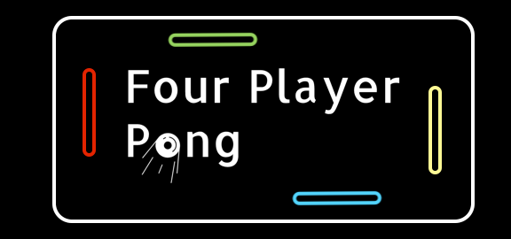
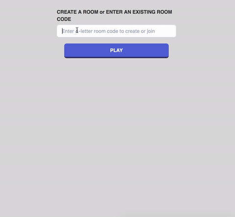
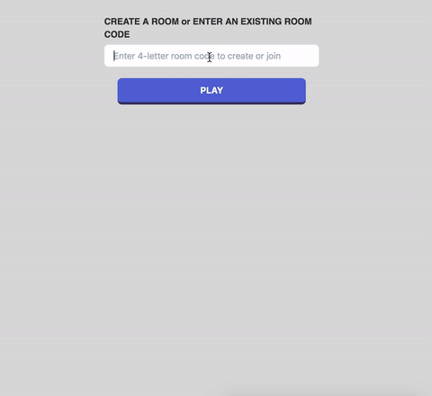
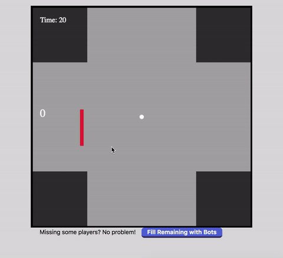

   

# Four Player Pong
An online version of the classic two player arcade game Pong — but with four players. Built with Node.js, Express, React, and SocketIO. 

Play the game here: https://four-player-pong.herokuapp.com/

## Table of Contents
* [Key Features](#key-features)
* [Built with](#built-with)
* [Challenges](#challenges)
* [Project Status](#project-status)

## Key Features
* Create a room and share the code for others to join, or join an existing one

* Play a live game of pong with your friends

	* Note: The other three players in this game chose not to move. 
* Play with bots if you don't have 4 people

* Compete against each other for the highest score

## Built with
* [Express](https://expressjs.com/) - Web application framework for Node.js
* [React](https://reactjs.org) - JavaScript library for building user interfaces
* [Socket.IO](https://socket.io) - JavaScript library for realtime web applications

## Challenges
As the state of the game (e.g. where the ball is, did the ball pass the goal?) is constantly changing, SocketIO involves heavy interaction with both client and server. As a result, I learned more about safely maintaining state and the value of hiding implementation details between the client and server.

## Project Status
This project is currently finished.